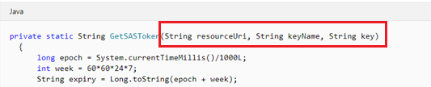
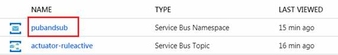
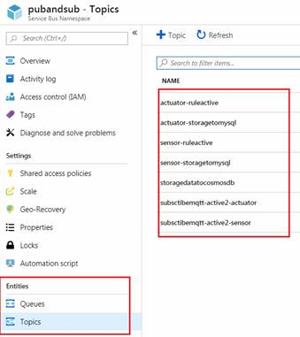
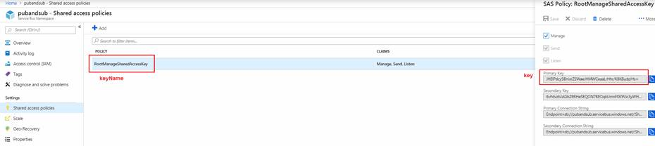
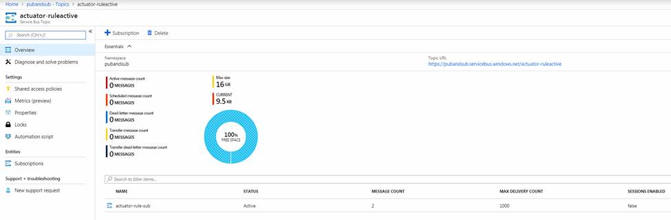

# Getting started to use Live Objects Http Push to Azure Event Hub # 

This getting started tutorial will describe how to route your Live Objects data stream to an Azure Event Hub. This will enable you to connect the powerful set of features from Live Objects (connectivity, Device Management, decoding, simple event processing) to the rest of your ecosystem on the Azure platform. The key point on Live Objects side is to configure an action policy that will route that data stream to the adequate Azure Event Hub endpoint through Http Push.

## Prerequisite : ##

In order to implement this tutorial, you will need :
*	A Live Objects account
*	Sufficient rights to use Live Objects Trigger and Actions policies. A "DISCOVER" account should be enough.
*	A Live Objects api key with (at least) __DATA_W__ and __EVENT_PROCESSING_W__ role
*	An Azure account;

## Setup your Azure Event Hub ##

[Event Hub getting started](https://docs.microsoft.com/fr-fr/azure/event-hubs/event-hubs-quickstart-portal)

## Create your SAS token ##

Live Objects will be seen as a single __event publisher__ from the Azure Event Hub point of view. Thus you will have to create a dedicated Shared Access Signature (SAS) key to identify that publisher. This key will enable to create a SAS token. This token will be passed along the HTTP POST operation, in the Authorization header, when sending an event to the Azure Event Hub.

1) in order to generate SAStoken you can follow the link:  [https://docs.microsoft.com/en-us/rest/api/eventhub/generate-sas-token](https://docs.microsoft.com/en-us/rest/api/eventhub/generate-sas-token)
In the function GetSASToken, input parameters “resourceUri”, “keyName”, “key” are required (java example).


 
•	“resourceUri”: service bus URL, format is [https://{servicebusNamespace}.servicebus.windows.net/{eventHubPath}/messages](https://{servicebusNamespace}.servicebus.windows.net/{eventHubPath}/messages)
o	{servicebusNamespace}: service bus name, you cloud find on the
 
 
 
o	{eventHubPath}: topic or the queue name in the service bus. If no topic or queue, you should create a new one.
 
  
 
•	“keyName”, “key”:

 
 
2)	When everything is done, you can check the event status from the portal.
 
 
 
3)	Regarding your questions on tokens, you can set the token expire time during the creation.

Reference :
*	[Azure Event Hub security model and Authentication](https://docs.microsoft.com/en-us/azure/event-hubs/event-hubs-authentication-and-security-model-overview)
*	[Sending an Event](https://docs.microsoft.com/en-us/rest/api/eventhub/send-event)

## Setup your Action Policy ##

```ruby
POST https://liveobjects.orange-business.com/api/v0/event2action/actionPolicies
x-api-key: your-api-key
Content-Type: application/json
{
    "name": "my-push-to-event-hub",
    "enabled": true,
    "triggers": {
        "messageSelector": {
            "origin": "data_new"
        }
    },
    "actions": {
        "httpPush": [{
            "webhookUrl": "https://{servicebusNamespace}.servicebus.windows.net/{eventHubPath}/messages",
            "headers": {
                "Authorization": ["SharedAccessSignature sr={URI}&sig={HMAC_SHA256_SIGNATURE}&se={EXPIRATION_TIME}&skn={KEY_NAME}"]
            }
        }]
    }
}
```

In the previous example you should replace the following placeholders with adequate values :
*	sevicebusNamespace
*	eventHubPath
*	Authorization SAS token

## Test by sending a data ##

```ruby
POST https://liveobjects.orange-business.com/api/v0/data/streams/my-stream
x-api-key: your-api-key
Content-Type: application/json
{
  "location": {
    "accuracy": 10,
    "alt": 5.00001,
    "lat": 45.000009,
    "lon": -30.00001,
    "provider": "GPS"
  },
  "model": "MyModelSettingName",
  "tags": [
    "Motor",
    "Engine"
  ],
  "value": {
    "hexaFlag001": "2F00",
    "temp": 22,
    "pressure": 36575
  }
}
```

## It's a wrap ##
The data should have been received in the event hub.
To go further you can read the developer documentation about http push and Triggers and Actions : [https://liveobjects.orange-business.com/doc/html/lo_manual_v2.html#E2A_HTTPPUSHACTION](https://liveobjects.orange-business.com/doc/html/lo_manual_v2.html#E2A_HTTPPUSHACTION)


